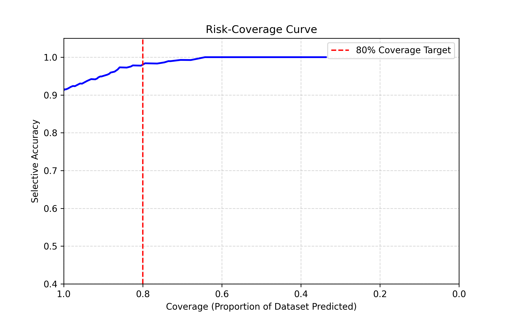
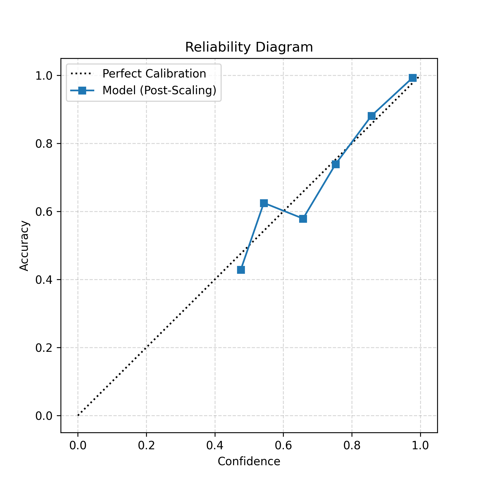
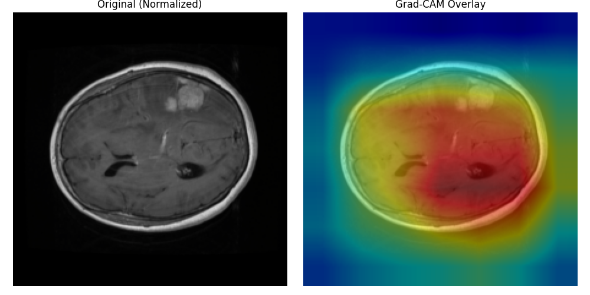

# Confidence-Aware Brain Tumor Classification

This repository implements a **reliability-first approach** to medical image classification. It uses deep learning (ResNet18) combined with **Temperature Scaling** to produce calibrated confidence scores, reducing the risk of "high-confidence hallucinations" in safety-critical diagnostics.

## Overview
### Problem Statement
Deep learning models are often **miscalibrated**, meaning they assign high confidence probabilities even to incorrect predictions. In medical AI, a model that is "wrong but confident" poses a severe risk to patient safety.

### Reliability in Medical AI
Reliability is as important as accuracy. A reliable system should:
1.  **Be Humble**: Assign low confidence when unsure.
2.  **Allow Abstention**: Defer to human experts when confidence is below a safety threshold.
3.  **Be Interpretable**: Provide visual evidence (Grad-CAM) for its decisions.

## Dataset
- **Source**: Cheng et al. Brain Tumor MRI Dataset (Figshare 1512427).
- **Classes**: Meningioma, Glioma, Pituitary Tumor.
- **Preprocessing**: 512x512 normalization, augmentation (rotation/flip).
- **Splitting**: **Patient-wise Split** to prevent data leakage (ensures slices from the same patient do not appear in both train and test sets).

## Model Architecture
- **Backbone**: ResNet18 (Pretrained on ImageNet).
- **Calibration**: **Temperature Scaling** (Post-hoc optimization of logits on validation set).
- **Safety Mechanism**: Threshold-based abstention (Rejects predictions with confidence < 0.8).
- **Interpretability**: Gradient-weighted Class Activation Mapping (Grad-CAM).

## MVP Results
Performance on the hold-out test set:

| Metric | Value | Interpretation |
| :--- | :--- | :--- |
| **Baseline Accuracy** | **92.3%** | Standard classification accuracy. |
| **ECE (Before Scaling)** | 0.124 | The model was overconfident. |
| **ECE (After Scaling)** | **0.031** | Excellent calibration (Probabilities reflect real accuracy). |
| **Hallucination Rate** | **2.78%** | Only ~3% of errors were "confident" (>0.8). |

## Reliability Evaluation

### 1. Risk-Coverage Curve
Demonstrates the trade-off between coverage (answering queries) and accuracy. By abstaining on the hardest 20% of cases, the model achieves **>98% accuracy** on the remaining 80%.



### 2. Calibration Curve (Reliability Diagram)
Post-calibration, the model's predicted confidence closely matches its empirical accuracy (diagonal line).



### 3. Interpretability (Grad-CAM)
Visualizes the regions of interest used for prediction.



## Project Structure
```
brain_tumor_confidence/
│
├── src/                # Source code
│   ├── data/           # Dataset processing & loading
│   ├── models/         # Model definitions
│   ├── training/       # Training loops
│   ├── confidence/     # Calibration & reliability utilities
│   └── interpretability/ # Grad-CAM implementation
│
├── scripts/            # Executable scripts
│   ├── train.py
│   └── evaluate_confidence.py
│
├── docs/               # Documentation assets
├── checkpoints/        # Saved model weights (git-ignored)
├── data/               # Raw dataset (git-ignored)
│
├── README.md
└── requirements.txt
```

## How to Run

### 1. Training (Optional)
Run standard training with default parameters:
```bash
python scripts/train.py --epochs 25
```

### 2. Evaluation
Run the full reliability test suite (ECE, Selective Prediction, Hallucination Rate):
```bash
python scripts/evaluate_confidence.py
```

## Limitations
- **Data Size**: The Cheng et al. dataset is relatively small (~3000 slices).
- **2D vs 3D**: Processing is done slice-by-slice, ignoring 3D volumetric context.
- **Validation**: Results are based on internal validation splits, not external clinical data.

## Future Work
- **Uncertainty Quantification**: Implementing Monte Carlo Dropout or Deep Ensembles.
- **Out-of-Distribution Detection**: Testing on healthy brain scans or other tumor types.
- **Advanced Architectures**: Comparison with ConvNeXt and Vision Transformers.

## Disclaimer
> **⚠️ NOT FOR CLINICAL USE**
> This software is for research and educational purposes only. It has not been validated for clinical use and should not be used for medical diagnosis.
